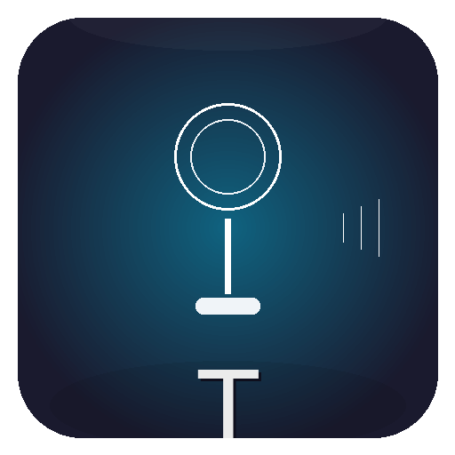

<p align="center">
  
</p>

<h1 align="center">Transkribator</h1>

<p align="center">
  <b>Voice-to-text for your desktop. Speak — it types.</b><br>
  Offline · Free · Russian-first · Windows
</p>

<p align="center">
  <a href="https://github.com/Lavr5000/Transkribator/releases/latest">
    
  </a>
  <a href="https://t.me/ai_vibes_coding_ru">
    
  </a>
  
</p>

---

## What it does

Transkribator turns your voice into text and pastes it directly into any active window. Press a hotkey, speak, release — done. No cloud, no API keys, no limits. Everything runs locally on your machine.

## Features

- **Instant voice input** — press `Ctrl+Shift+Space`, speak, text appears where your cursor is
- **100% offline** — your voice never leaves your computer
- **Russian-first** — powered by Sherpa-ONNX with the `giga-am-v2-ru` model, optimized for Russian speech
- **Smart post-processing** — automatic capitalization, punctuation, and correction of common recognition errors
- **Custom dictionary** — add your own words and corrections
- **Multiple backends** — Sherpa-ONNX (fast, default) or Whisper (multi-language)
- **Compact UI** — tiny always-on-top window that stays out of your way
- **System tray** — minimizes to tray, launches at startup

## Download

### Ready-to-use EXE (Windows)

Go to [**Releases**](https://github.com/Lavr5000/Transkribator/releases/latest), download the ZIP archive, extract, and run `Transkribator.exe`. No installation or Python required.

### From source

```bash
git clone https://github.com/Lavr5000/Transkribator.git
cd Transkribator
python -m venv venv
venv\Scripts\activate
pip install -r requirements.txt
python main.py
```

## Usage

1. Launch `Transkribator.exe` (or `python main.py`)
2. Click the microphone button or press `Ctrl+Shift+Space`
3. Speak
4. Press the hotkey again — text is pasted into the active window

### Settings

- **Backend**: Sherpa-ONNX (default, fast) or Whisper
- **Quality profile**: Fast / Balanced / Quality
- **Language**: Russian (default), or auto-detect with Whisper
- **Custom dictionary**: Add corrections for domain-specific terms

## System Requirements

| | Minimum | Recommended |
|---|---------|-------------|
| **OS** | Windows 10 | Windows 11 |
| **RAM** | 4 GB | 8 GB |
| **Disk** | 500 MB (Sherpa) | 2 GB (with Whisper models) |
| **Python** | 3.10+ (from source only) | 3.13 |

GPU is optional — Sherpa-ONNX runs efficiently on CPU.

## Tech Stack

- **Speech recognition**: [Sherpa-ONNX](https://github.com/k2-fsa/sherpa-onnx) (giga-am-v2-ru), [faster-whisper](https://github.com/guillaumekln/faster-whisper)
- **GUI**: PyQt6
- **Hotkeys**: pynput
- **Audio**: sounddevice + numpy
- **Build**: PyInstaller

## Crash Reporting & Watchdog

Transkribator includes a built-in crash reporting system:

- **Automatic crash reports** — on unhandled exceptions, a JSON report is saved to `%LOCALAPPDATA%/WhisperTyping/WhisperTyping/crashes/` with exception details, system info, and recent log lines
- **C-level fault handler** — catches segfaults and fatal errors via Python's `faulthandler` module
- **Telegram notifications** — crash reports are sent to your Telegram Saved Messages (optional, requires Telethon setup)
- **Quality monitor** — detects transcription quality degradation (3+ consecutive empty results) and sends alerts
- **Watchdog** — `scripts/watchdog.py` runs the app as a subprocess, auto-restarts on crash (max 3 restarts in 5 minutes)

### Running with watchdog

```bash
python scripts/watchdog.py
```

## License

MIT — free for personal and commercial use.

## Links

- [Portfolio: AI Vibes](https://lavr5000-portfolio.pages.dev) — all projects
- [Telegram: AI Vibes](https://t.me/ai_vibes_coding_ru) — updates and discussion
- [YouTube](https://www.youtube.com/@Lavr5000) — demos and tutorials
- [Releases](https://github.com/Lavr5000/Transkribator/releases) — download latest version
